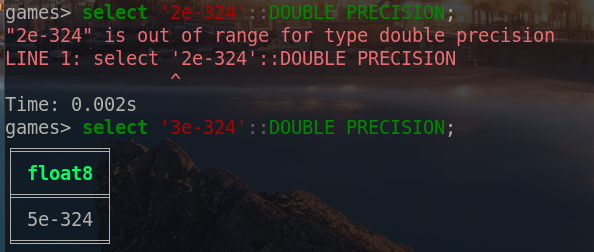
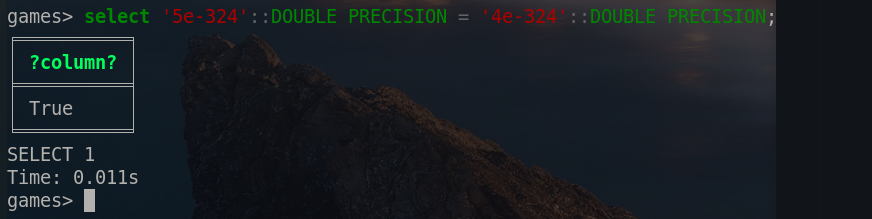

------------

## 4.5 Массивы
---

* Для объявления массивов в PostgreSQL используется конструкция 'тип_данных[]'
* Для проверки содержание определенных элементов в массиве используется оператор @>
* Для проверки и/или используется оператор &&

# Ответы на вопросы 
---

## 1.

> У нас есть тип данных numeric(5, 2), который означает, что **после округления** число должно быть **не более 5 сиволов в длинну** (включая символы после запятой). И должно содержать **не более 2-х знаков после запятой**.
>
> Если мы попытаемся вставить в таблицу значение вида **999.999**, то PostgreSQL округлит это значение до **1000.00** и оно уже не будет удовлетворять _numeric(5, 2)_, а -- _numeric(6, 2)_. При этом мы можем вставить в таблицу значения вида **999.9** и даже **999.99**, так как при окрулгелнии они будут иметь вид **999.90** и **999.99** соответсвенно, что удовлетворяет _numeric(5, 2)_.

## 2.

> Мы можем указать тип numeric без указания масштаба и точности. В таком случае все значения записанные в таблицу будут зранится в том виде, в котором они указывались.
> 

## 3.

> Тип данных numeric содержит значение NaN которое обозначает "не число" (not-a-number). Значение NaN больше любого другого значения типа "не NaN".
> 

## 4.

> Нужно быть аккуратнее при сравнении чисел с плавающей точкой, потому что это может привести к неожиданным результатам.
> Если выполнить такой запрос:
> 
> То он отработает правильно и выведет на экран "True".
> Но если выполнить такой запрос:
> 
> То вернется значение "False", хотя должно вернуться значение "True".
> Я думаю что это потому что у типа double precision есть ограниение до **5e-324** и значение ниже этого PostgreSQL не может обработать.
> 
> Реальное ограничение для double precision:
> 
> Но при этом все значения после 323 степени, он округляет до **5e-324**
> 

## 5.

> У типа double precision есть специальные значение **infinity** и **-infinity**. Они больше всех числовых значений в PostgreSQL, но зачем они нужны?
> Не понимаю.

## 6.

> NaN может быть неопределенностю, например если умножить 0 на бесконечность. Так же NaN больше даже бесконечности.

## 7-8.

> **serial** аналог автоинкремента. Каждый раз когда в таблицу **записывается новое значение без явного указания id** этому значению присваивается id+1. Если в таблицу добавляют значение с явным указанием id, то автоинкремент не сработает и когда в следующий раз будет запись в бд без указания id, будет ошибка:
> 

## 9.

> Григорианский календарь 